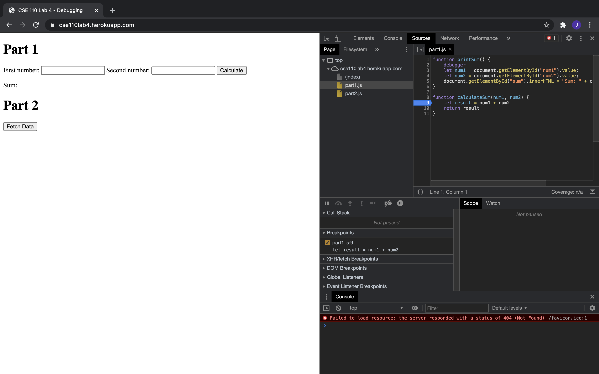
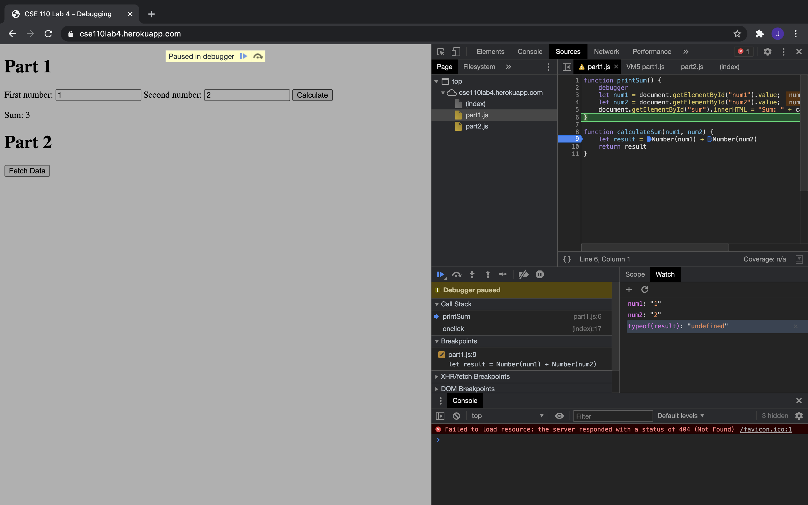

#### Part3

The Bug is that result is storing a string whcih means that num1 and num2 are being treated as strings rather than ints. 
One way to fix this error is to put Number(num1) + Number(num2) rather than num1+num2.

